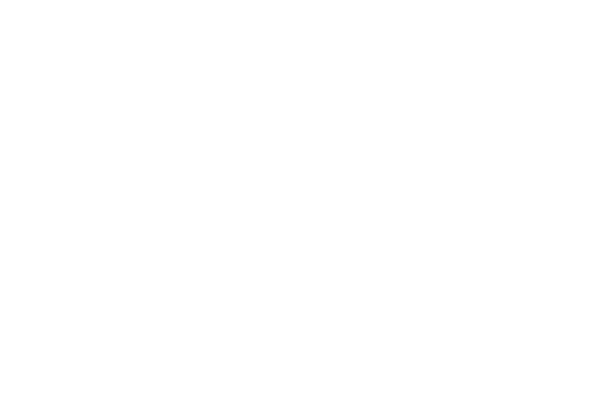
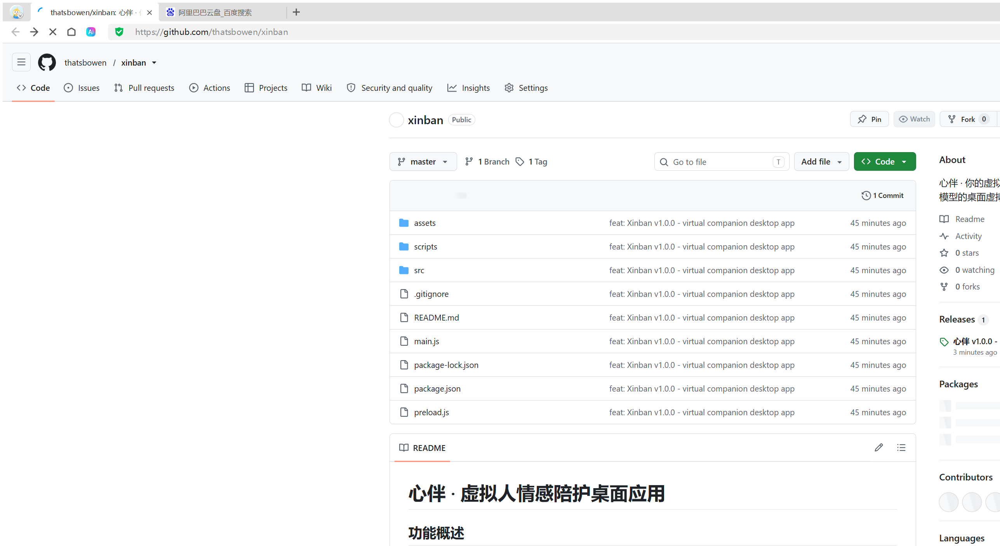
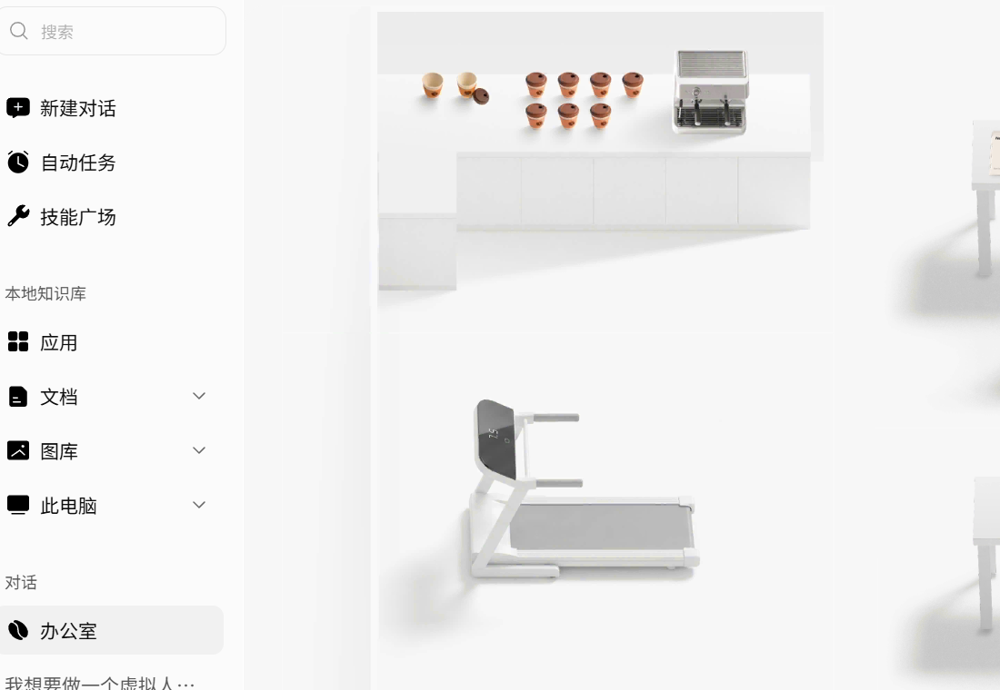

<div align="center">


# 心伴 · 你的虚拟情感陪护

*桌面上的 AI 灵魂伴侣，24 小时在线温暖相伴*

[](https://github.com/thatsbowen/xinban)
[](https://electronjs.org)
[](LICENSE)
[](https://github.com/thatsbowen/xinban/releases)

[English](README_EN.md) | 中文

</div>

---

## 简介

**心伴** 是一款基于大模型的桌面虚拟人情感陪护应用。你只需设定姓名、性别、年龄和性格，即可生成专属的虚拟伙伴——拥有独特的形象、一致的个性和 24 小时在线陪伴能力。

集成 [MiniMax 开放平台](https://platform.minimaxi.com) 的 MiniMax-M3 语言模型与 image-01 图像模型，从角色初始化到日常对话再到定时关怀，全程由 AI 驱动，为你打造一个有温度的桌面伴侣。

---

## 界面预览

| 初始化 | 模型配置 | 主界面 | 打赏 |
|:---:|:---:|:---:|:---:|
|  |  |  |  |

---

## 下载

| 包 | 大小 | 说明 |
|----|------|------|
| [心伴-Setup-1.0.0.exe](https://github.com/thatsbowen/xinban/releases/download/v1.0.0/心伴-Setup-1.0.0.exe) | 79.8 MB | NSIS 安装包（Windows） |
| [心伴-Portable-1.0.0.exe](https://github.com/thatsbowen/xinban/releases/download/v1.0.0/心伴-Portable-1.0.0.exe) | 72.5 MB | 绿色免安装版（Windows） |
| [心伴-1.0.0-x64.zip](https://github.com/thatsbowen/xinban/releases/download/v1.0.0/心伴-1.0.0-x64.zip) | 108 MB | Zip 压缩包（Windows） |

> **macOS 用户**：需在 Mac 上从源码构建，执行 `npm run build:mac` 生成通用 DMG（Intel + Apple Silicon）。

---

## 功能亮点

### 个性化角色创建
填写 4 项信息（姓名 / 性别 / 年龄 / 性格），系统自动调用大模型构建角色记忆，并生成高清虚拟人全身照与头像。

### 智能对话陪伴
基于 MiniMax-M3 模型，角色始终保持一致的人格。每次启动自动加载历史对话上下文，越聊越懂你。

### 主动定时关怀
| 触发条件 | 虚拟人行为 |
|----------|-----------|
| 每 10 分钟轮询 | "哇，我们相处一会了，是需要休息一下吗？" |
| 每日 08:00 / 18:00 | "你吃过了吗？吃的可是什么好吃的呀？" |
| 每日 12:30 | "emmm...这个点是不是需要休息下呢？" |
| 每日 22:00 | "你想知道明天天气如何吗？" |

### 本地数据存储
- 所有对话以 JSON 格式存储于本地用户目录
- 4 要素 + 最近 10 条对话每次启动时自动同步给大模型
- 无需联网即可回看历史聊天记录

### 打赏支持
- 第 3 次启动时弹出打赏页面（收款二维码可自定义）
- 之后保留底部「赞赏」按钮，支持自定义金额

---

## 技术栈

| 层级 | 技术 |
|------|------|
| 桌面框架 | Electron 30 |
| 打包工具 | electron-builder |
| 前端 | HTML5 / CSS3 / Vanilla JS |
| AI 模型 | MiniMax-M3（对话）、image-01（图像生成） |
| 图像处理 | sharp |
| 存储方案 | 本地 JSON 文件系统 |

---

## 快速开始

### 环境要求

- **Node.js** >= 18
- **npm** >= 9

### 安装运行

```bash
git clone https://github.com/thatsbowen/xinban.git
cd xinban
npm install
npm start
```

### 获取 API Key

1. 打开 [platform.minimaxi.com](https://platform.minimaxi.com) 注册账号
2. 在「账户中心」充值 **10 元体验金**
3. 在「API Keys」页面创建 Key
4. 将 Key 粘贴到应用配置页面的输入框中完成绑定

---

## 构建安装包

```bash
# 生成多尺寸图标
npm run generate-icons

# Windows
npm run build:win:setup    # NSIS 安装包 (.exe)
npm run build:win:portable  # 绿色免安装版 (.exe)

# macOS（需在 macOS 环境执行）
npm run build:mac           # Universal DMG (x64 + arm64)
```

构建产物位于 `dist/` 目录。

---

## 项目结构

```
xinban/
├── main.js                # Electron 主进程（窗口/API/定时任务/存储）
├── preload.js             # 预加载脚本（安全 IPC 桥接）
├── src/
│   ├── index.html         # SPA 入口（含全部页面）
│   ├── styles.css         # 全局样式
│   └── renderer.js        # 渲染进程（路由/交互逻辑）
├── assets/
│   ├── icon.svg           # 图标源文件
│   └── qrcode.jpg         # 内置收款二维码
├── screenshots/           # 应用截图
├── scripts/
│   └── generate-icons.js  # 图标生成脚本
└── package.json           # 项目配置 & 构建定义
```

---

## 常见问题

**Q: 为什么需要充值 10 元？**
A: MiniMax 平台需要账户余额才能调用 API。10 元体验金足够长时间使用。

**Q: 我的数据安全吗？**
A: 所有数据（配置、对话记录、图片）均存储在本地用户目录，不上传任何服务器。API Key 仅用于调用 MiniMax 接口。

**Q: 可以更换虚拟人形象吗？**
A: 当前版本在初始化时生成形象。后续版本将支持重新生成。

**Q: macOS 怎么安装？**
A: macOS 构建须在 Mac 上执行。将项目复制到 Mac 后运行 `npm run build:mac` 即可生成 dmg 安装镜像，支持 Intel 和 Apple Silicon 芯片。

---

## 许可证

MIT License © 2025

---

<div align="center">

*如果这个小家伙给你带来了温暖，不妨请开发者喝杯咖啡 ☕*

</div>
